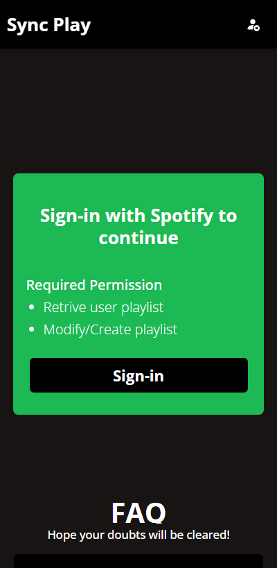
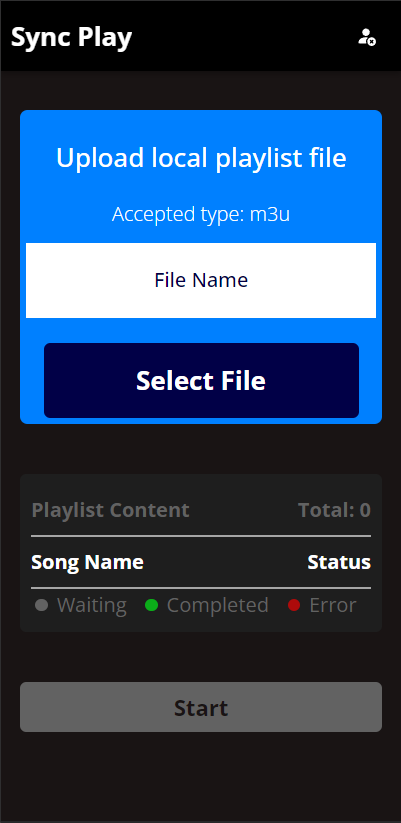
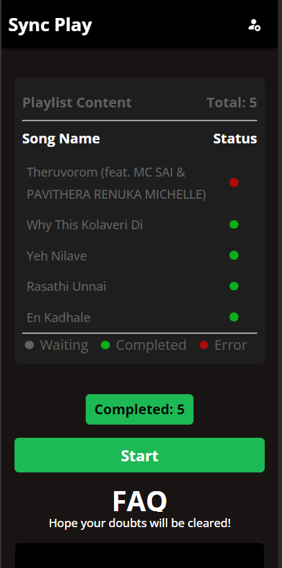

# Sync Play

#### About The Project
The main goal of this project is to sync the local playlist with playlist in Spotify. This site can only support syncing from local to Spotify, not vice-versa. It is built using Vite and React. Feel free to fork the project and work on it as you wish

#### Screen Shots




#### Note
Since there is rate-limiting by Spotify this site may or may not work properly sometime. So I recommend you to fork this project and Host your own version either locally or on cloud for seamless functioning of the site. To get started read from `Before getting started`.


See [Demo Site](https://sync-play-nu.vercel.app/signin)


# Before getting started
This app uses Spotify API to get song details and update playlist. Before you start working on this, you are arequired to setup an app in [Spotify Developers Site](https://developer.spotify.com/) and get a `CLIENT_ID` and `CLIENT_ID`. After getting these paste them in `src\services\const.jsx` for the app to work.


# Steps
Built using Vite and React

Get started with the project
1. Clone this repo
2. Run npm install
3. Run npm run dev

```
{
  "scripts": {
    "dev": "vite", // start dev server
    "build": "vite build", // build for production
    "serve": "vite preview" // locally preview production build
  }
}
```